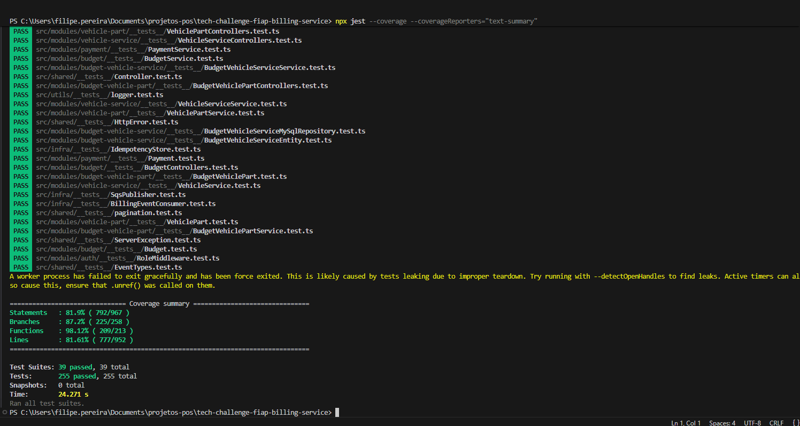

# Billing Service (Microsserviço de Faturamento)

Microsserviço responsável pelo gerenciamento de orçamentos, peças, serviços de veículos e pagamentos.

## Domínios

- **Budget** — Orçamentos (criação e consulta)
- **Vehicle Part** — Catálogo de peças de veículos (CRUD)
- **Vehicle Service** — Catálogo de serviços de veículos (CRUD)
- **Budget Vehicle Part** — Associação orçamento ↔ peça
- **Budget Vehicle Service** — Associação orçamento ↔ serviço
- **Payment** — Pagamentos (criação, confirmação, rejeição, webhook MercadoPago)

## Tecnologias

- Node.js 22 + TypeScript
- Express
- MySQL (mysql2)
- AWS SQS (mensageria assíncrona)
- MercadoPago SDK (pagamentos)
- Zod (validação)
- Jest + Supertest (testes)
- Docker + Kubernetes

## Estrutura

```
src/
├── server.ts
├── utils/logger.ts
├── infra/db/
├── shared/
│   ├── application/
│   ├── domain/
│   ├── events/
│   ├── http/
│   ├── messaging/
│   └── resilience/
└── modules/
    ├── auth/
    ├── budget/
    ├── vehicle-part/
    ├── vehicle-service/
    ├── budget-vehicle-part/
    ├── budget-vehicle-service/
    └── payment/
```

## Eventos SQS

### Publicados
| Evento | Descrição |
|--------|-----------|
| `BUDGET_CREATED` | Orçamento criado |
| `BUDGET_APPROVED` | Orçamento aprovado |
| `BUDGET_REJECTED` | Orçamento rejeitado |
| `PAYMENT_CONFIRMED` | Pagamento confirmado |
| `PAYMENT_FAILED` | Pagamento falhado |

### Consumidos
| Evento | Origem | Ação |
|--------|--------|------|
| `OS_CREATED` | OS Service | Notificação de nova OS |
| `OS_BUDGET_APPROVED` | OS Service | Atualiza status do orçamento |
| `OS_BUDGET_REJECTED` | OS Service | Atualiza status do orçamento |

## Endpoints

### Auth
- `POST /auth/validate` — Validar token JWT

### Budgets
- `POST /budgets` — Criar orçamento (admin)
- `GET /budgets/:id` — Buscar orçamento por ID

### Vehicle Parts
- `POST /vehicle-parts` — Criar peça (admin)
- `GET /vehicle-parts` — Listar peças (admin)
- `GET /vehicle-parts/:id` — Buscar peça por ID (admin)
- `PUT /vehicle-parts/:id` — Atualizar peça (admin)
- `DELETE /vehicle-parts/:id` — Remover peça (admin)

### Vehicle Services
- `POST /vehicle-services` — Criar serviço (admin)
- `GET /vehicle-services` — Listar serviços (admin)
- `GET /vehicle-services/:id` — Buscar serviço por ID (admin)
- `PUT /vehicle-services/:id` — Atualizar serviço (admin)
- `DELETE /vehicle-services/:id` — Remover serviço (admin)

### Budget Vehicle Parts
- `POST /budget-vehicle-parts` — Associar peça ao orçamento (admin)

### Budget Vehicle Services
- `POST /budget-vehicle-services` — Associar serviço ao orçamento (admin)
- `GET /budget-vehicle-services/:id` — Buscar por ID (admin)
- `PUT /budget-vehicle-services/:id` — Atualizar (admin)
- `DELETE /budget-vehicle-services/:id` — Remover (admin)

### Payments
- `POST /payments` — Criar pagamento (admin)
- `GET /payments/:id` — Buscar pagamento por ID
- `GET /payments/budget/:budgetId` — Buscar pagamento por orçamento
- `POST /payments/:id/confirm` — Confirmar pagamento (admin)
- `POST /payments/:id/reject` — Rejeitar pagamento (admin)
- `POST /payments/webhook` — Webhook MercadoPago

## Setup Local

```bash
npm install
cp .env.example .env
# Configurar variáveis no .env
npm run dev
```

## Testes

```bash
npm test
npm run test:coverage
```

### Cobertura de Testes Unitários



## Deploy

```bash
docker build -t billing-service .
kubectl apply -f k8s/
```

## Variáveis de Ambiente

| Variável | Descrição |
|----------|-----------|
| `PORT` | Porta do servidor (default: 3001) |
| `DB_HOST` | Host MySQL |
| `DB_PORT` | Porta MySQL |
| `DB_USER` | Usuário MySQL |
| `DB_PASS` | Senha MySQL |
| `DB_NAME` | Nome do banco |
| `JWT_SECRET` | Segredo JWT |
| `AWS_REGION` | Região AWS |
| `AWS_ACCESS_KEY_ID` | Chave de acesso AWS |
| `AWS_SECRET_ACCESS_KEY` | Chave secreta AWS |
| `SQS_BILLING_EVENTS_QUEUE_URL` | URL fila SQS billing |
| `SQS_OS_EVENTS_QUEUE_URL` | URL fila SQS OS |
| `SQS_EXECUTION_EVENTS_QUEUE_URL` | URL fila SQS execution |
| `MERCADOPAGO_ACCESS_TOKEN` | Token de acesso MercadoPago |